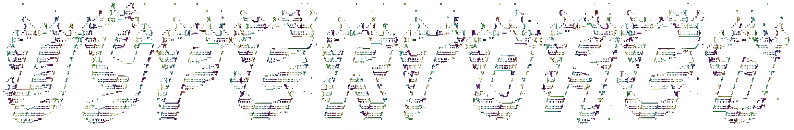

# 

<div align=center>

_A mission of [The Carpocratian Church of Commonality and Equality](https://carpocratian.org/en/church/)_</div>

<div align=center></div>

---

**HyperToken** is a **Distributed Simulation Engine** where relationships create meaning, and meaning creates worlds.

Built on **[Automerge](https://automerge.org/) CRDTs** for mathematical consensus, **[OpenAI Gym](https://gymnasium.farama.org/)** for AI research, and a **Host-Authoritative P2P** architecture for fairness without servers, HyperToken delivers what blockchain gaming promised but never achieved: persistent, cheat-proof worlds that cost nothing to run.

---

## 🌟 What Makes HyperToken Different?

**Traditional Multiplayer:** "Server, may I move here?" → Server decides → "Yes/No" → 💸 Monthly hosting bills

**Blockchain Gaming:** "Smart contract, execute my move" → Pay gas fee → Wait 15 seconds → ⛽ Transaction costs

**HyperToken:** "I'm moving here" → CRDTs merge → Same result everywhere → 🆓 **Zero infrastructure**

### The Core Innovation

HyperToken treats the **entire game state as a CRDT** (Conflict-Free Replicated Data Type). This means:
- 🌍 **No servers required** - Any peer can host
- ⚡ **Instant local execution** - No waiting for confirmation  
- 🔒 **Mathematically guaranteed consistency** - Desyncs are impossible
- 📝 **Perfect audit trail** - Every action recorded with actor and timestamp
- ✈️ **Offline-first** - Play continues during network partitions

---

## 🎯 Who Is HyperToken For?

### **For Game Developers** 🎮
> "If it's not fun in the terminal, it won't be fun in 3D"

- **Rapid prototyping** - Test mechanics in pure logic before investing in graphics
- **Serverless multiplayer** - Ship multiplayer games with zero infrastructure
- **Built-in anti-cheat** - Host-authoritative pattern prevents exploitation
- **Save months of netcode** - Synchronization "just works"

### **For AI Researchers** 🤖
> "Any game is automatically a training environment"

- **OpenAI Gym compatible** - Works with any RL framework
- **1000x real-time** - Train agents faster than humanly possible
- **Multi-agent scenarios** - Native support for competitive/cooperative AI
- **Deterministic replay** - Perfect reproducibility for papers

### **For Communities** 🌐
> "The world lives as long as someone wants to play"

- **Persistent worlds without servers** - Communities own their games
- **Fork any world** - Don't like the rules? Fork it like Git
- **Headless autonomous worlds** - Games that play themselves
- **No corporate intermediary** - Direct peer-to-peer connections

---

## ✨ Core Features

### **Complete Action System** (58 Actions)
Every action you need for discrete simulations, fully implemented and tested:

```javascript
// Everything from card games...
engine.dispatch("stack:shuffle", { seed: 42 });
engine.dispatch("agent:drawCards", { count: 5 });

// ...to resource management...
engine.dispatch("agent:transfer", { 
  from: "Alice", to: "Bob", 
  resource: "gold", amount: 50 
});

// ...to complex token relationships
engine.dispatch("token:merge", { tokens: [sword, enchantment] });
engine.dispatch("token:split", { token: hydra, pieces: 3 });
```

### **Distributed by Default**
```javascript
// Start host
const host = new Engine();
host.connect("ws://relay.local:8080");

// Join from anywhere
const client = new Engine();  
client.connect("ws://relay.local:8080");

// State automatically synchronizes via CRDTs
// Both see the same game, always
```

### **AI Training Interface**
```typescript
// Any game becomes a Gym environment
class MyGameEnv extends GymEnvironment {
  get observationSpace() { return { shape: [84, 84, 4] }; }
  get actionSpace() { return { n: 18 }; }
  
  async step(action: number) {
    this.engine.dispatch(this.actionMap[action]);
    return {
      observation: this.getObservation(),
      reward: this.calculateReward(),
      terminated: this.isGameOver()
    };
  }
}
```

---

## 🚀 Quick Start

```bash
# Install
git clone https://github.com/your-org/hypertoken.git
cd hypertoken
npm install
npx tsc

# Run multiplayer Blackjack
node dist/examples/blackjack/server.js
node dist/examples/blackjack/client.js Alice  # Terminal 2
node dist/examples/blackjack/client.js Bob    # Terminal 3

# Explore other examples
node dist/examples/prisoners-dilemma/pd-cli.js  # Game theory
node dist/examples/tarot-reading/tarot-cli.js    # Divination
node dist/examples/accordion/accordion.js         # "Impossible" solitaire
```

---

## 🏗️ Architecture

```
hypertoken/
├── core/                   # Foundation (TypeScript)
│   ├── Token.ts           # The universal entity
│   ├── Stack.ts           # Ordered collections  
│   ├── Space.ts           # Spatial zones
│   ├── Chronicle.ts       # CRDT state management
│   └── ConsensusCore.ts   # P2P synchronization
│
├── engine/                 # Game Logic (TypeScript)
│   ├── Engine.ts          # Core coordinator
│   ├── GameLoop.ts        # Turn management
│   ├── RuleEngine.ts      # Law enforcement
│   └── actions-extended.ts # 58 built-in actions
│
├── network/                # Distribution (TypeScript)
│   ├── PeerConnection.ts  # WebSocket client
│   └── RelayServer.ts     # Minimal relay
│
├── interface/              # Adapters
│   ├── Gym.ts             # OpenAI Gym compatible
│   ├── OpenAIAgent.js     # LLM integration
│   └── CLIInterface.js    # Terminal UI
│
└── examples/              # Complete Games
    ├── blackjack/         # Casino with AI
    ├── prisoners-dilemma/ # 14 strategies
    ├── network-tictactoe/ # P2P example
    ├── tarot-reading/     # 8 spreads
    └── accordion/         # AI challenge
```

---

## 🔮 The Philosophy

> "A token isn't valuable because of what it IS — it's valuable because of its relationships"

In HyperToken, value comes from:
- **Who owns it** (agents, players)
- **What's attached to it** (enchantments, status effects)
- **Where it is** (zones, positions)
- **What rules govern it** (policies, validators)
- **Who wants it** (goals, economies)

This applies equally to cards in blackjack, shares in a market, or NPCs in a world.

---

## 🌍 Comparable To (But Different From)

| System | What They Do | What We Do Better |
|--------|-------------|-------------------|
| **Unity/Godot** | Graphics-first engines | Logic-first, validate fun before visuals |
| **Blockchain Games** | Costly on-chain logic | Free P2P with same guarantees |
| **MUD Framework** | Blockchain autonomous worlds | True serverless, no gas fees |
| **Colyseus** | Authoritative game server | P2P, no server needed |
| **Yjs/Automerge** | Document collaboration | Game-aware abstractions |

**HyperToken is the first engine where the entire game state is a CRDT by default.**

---

## 📖 Documentation

- **[Complete Action Reference](./engine/ACTIONS.md)** - All 58 actions documented
- **[Enterprise Use Cases](./ENTERPRISE_USE_CASES.md)** - AI training, market simulation
- **[Community Use Cases](./COMMUNITY_USE_CASES.md)** - Serverless multiplayer, persistent worlds
- **[Network Architecture](./network/README.md)** - P2P synchronization details
- **[Example Games](./examples/)** - Learn by playing

---

## 🎓 Why HyperToken Matters

### For Gaming
- **Democratizes multiplayer** - No AWS bills, no DevOps, just games
- **Enables new genres** - Games that fork, merge, and evolve like Git repos
- **Community ownership** - Worlds that outlive their creators

### For Research  
- **Simplified agent training** - Focus on AI, not infrastructure
- **Perfect reproducibility** - Deterministic replay for every paper
- **Multi-agent paradise** - Native support for complex interactions

### For the Future
- **Local-first revolution** - Computing that respects users
- **Post-blockchain consensus** - Decentralization without the cult
- **Relationship computing** - Beyond objects to connections

---

## 🛠️ Roadmap

### Phase 1: Polish (Now)
- [ ] Complete TypeScript migration
- [ ] Unified documentation site
- [ ] Performance benchmarks

---

## 🤝 Contributing

HyperToken thrives on community contributions. Whether you're building games, training agents, or exploring new frontiers in distributed systems, we want to hear from you.

```bash
# Get started
git clone https://github.com/your-org/hypertoken.git
cd hypertoken
npm install
npm test

# Join the conversation
Discord: [coming soon]
Matrix: [coming soon]
```

See [CONTRIBUTING.md](./CONTRIBUTING.md) for guidelines.

---

## 📜 License

Copyright © 2025 The Carpocratian Church of Commonality and Equality, Inc.

Licensed under the Apache License, Version 2.0. See [LICENSE](./LICENSE) for details.

---

## 👥 Credits

**Created by Marcellina II (she/her)**

With inspiration from:
- Martin Kleppmann's work on CRDTs
- Rich Hickey's philosophy on state and time
- The legacy of HyperCard's creative accessibility

---

## 🜍 Proemium to the Art of Tokens

*The All is number, and from number flow the forms of things.*  
*For as the Monad abides in simplicity, so does it unfold the Dyad,*  
*and from their tension spring the harmonies that sustain the world.*

*Among the arts that imitate the order of the heavens,*  
*there now arises one most subtle and most just — the Art of Tokens.*

*In this art, every being is rendered as a form in relation,*  
*every action as a motion among forms,*  
*and the laws that bind them are set forth as measure and correspondence.*

*The tokens are not bodies, nor mere signs,*  
*but living numbers that move in the field of reason.*  
*Each bears the likeness of its cause,*  
*and through their intercourse the manifold becomes intelligible.*

*Let none deem this art a toy of artifice.*  
*It is the discipline by which the mind rehearses creation,*  
*a mirror held to the pattern of the world-soul.*

*So may this art be given freely,*  
*that all who love Wisdom may join the music of the spheres through understanding,*  
*and that the harmony of minds may become the harmony of worlds.*

*For when reason is made common, the gods are near.*

---

<div align="center">

**HyperToken: Where relationships create meaning, and meaning creates worlds.** 🌍✨

[Website](https://hypertoken.ai)

</div>
